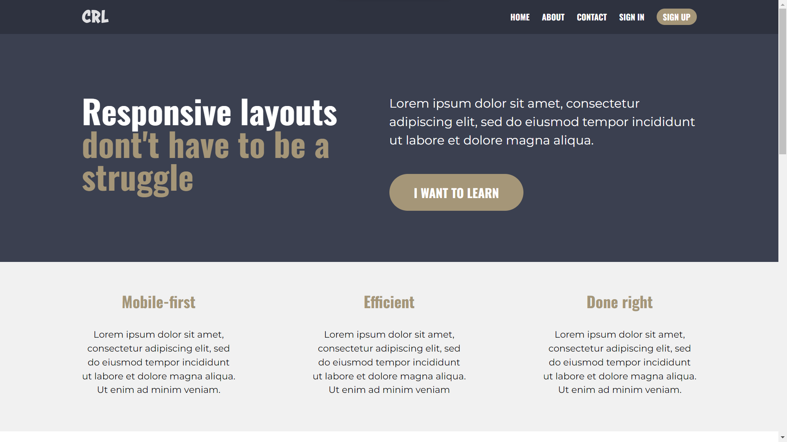

# Conquering Responsive Layouts | Final Challenge

During the 21 days of the free course Conquering Responsive Layouts of Kevin Powell I learned how to use pure HTML, CSS and JS to build responsive websites using FlexBox, classes reuse and manipulations, semantic tags, events of js, media queries, use of rem and em in css, mobile-first application and more.
I built this final challenge using all these learned concepts and with that I became able to apply them in other challenges.

## The website
Check out the url of the full website I developed and check the responsiveness: [link]()

## Links

Kevin Powell [Youtube Channel](https://www.youtube.com/@KevinPowell).

Kevin Powell [Courses](https://www.kevinpowell.co/courses/).

## Contributing

Any input is welcome.